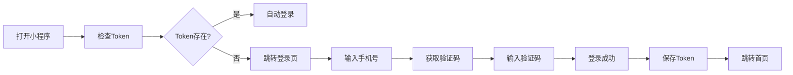
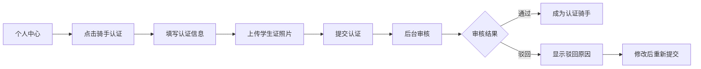
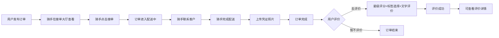
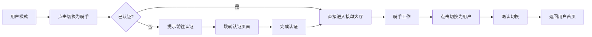

# 校园跑腿配送系统 - UniApp前端

## 📱 项目简介

这是一个基于 UniApp 开发的校园跑腿配送小程序，支持用户和骑手双身份切换。用户可以发布帮买、帮送、帮取、全能等订单，骑手可以接单配送并获得收入。

## ✨ 核心功能

### 👤 用户端功能

#### 1. 用户认证
- **手机号登录**
  - 手机号 + SMS验证码登录
  - JWT Token 认证机制
  - 自动登录（Token有效期7天）
  - 手机号脱敏显示

#### 2. 首页
- **顶部定位栏**：显示当前所在学校/位置
- **轮播横幅**：展示活动公告
- **功能导航**：
  - 🛒 帮买（代购商品）
  - 📦 帮送（配送物品）
  - 🔑 帮取（代取快递/文件）
  - 🌟 全能（综合服务）
- **快速发布卡片**：一键创建订单
- **最近订单**：展示最近进行的订单

#### 3. 订单管理
- 订单列表（全部/待接单/配送中/已完成/已取消）
- 订单详情查看
- 订单创建（帮买/帮送/帮取/全能）
- 订单支付（余额支付）
- 取消订单
- **订单评价系统（新增）**：
  - 星级评分（1-5星）
  - 预设评价标签（配送速度快、服务态度好等）
  - 详细评价文字输入
  - 查看历史评价
  - 评价状态管理（未评价/已评价）

#### 4. 个人中心
- **用户信息展示**：
  - 头像、昵称、手机号
  - 账户余额、信用分
  - 骑手认证状态
- **身份切换**：
  - 快速切换为骑手模式
  - 已认证骑手直接进入接单大厅
  - 未认证提示前往认证
- **常用功能**：
  - 📍 我的地址簿
  - 💰 我的钱包
  - 🛡️ 骑手认证
  - ⭐ 我的评价
  - ⚙️ 设置
- 退出登录

### 🛵 骑手端功能

#### 1. 骑手认证
- **学生证认证申请**：
  - 真实姓名
  - 学号（8-12位）
  - 学校名称
  - 所属学院
  - 学生证照片上传（OSS存储）
- **认证状态跟踪**：
  - ⏳ 审核中
  - ✅ 已通过
  - ❌ 已驳回（显示驳回原因）
- **状态展示**：自动回填认证信息，支持重新申请

#### 2. 接单大厅
- **订单筛选**：
  - 距离最近
  - 金额最高
  - 全部订单
- **订单卡片展示**：
  - 订单类型标签（帮买/帮送/帮取/全能）
  - 配送费用（高亮显示）
  - 取货地址 & 送货地址
  - 距离、时间、物品描述
- **一键接单**：确认后立即接单
- **下拉刷新**：实时更新订单列表
- **空状态提示**：无订单时引导刷新

#### 3. 配送中
- **当前配送订单**：
  - 进度条展示（已接单 → 配送中 → 已完成）
  - 配送地址信息
  - 联系人信息
- **操作功能**：
  - 📞 拨打电话联系
  - ✅ 完成配送（上传凭证图片）
- **今日统计卡片**：
  - 今日完成单数
  - 今日收入
  - 评分
- **空状态引导**：无订单时引导前往接单大厅

#### 4. 业绩统计
- **收入卡片**：
  - 💰 总收入（本月）
  - 💵 账户余额
  - 📈 今日收入
  - 提现按钮（开发中）
- **数据统计**：
  - 总单数、今日单数
  - 评分、完成率
- **近期流水**：
  - 订单收入记录
  - 收入/支出标识
- **评分统计**：
  - 综合评分
  - 总评价数
  - 好评率
  - 查看全部评价

#### 5. 骑手导航
- **底部TabBar**：
  - 🏠 接单大厅
  - 📦 配送中
  - 📊 业绩
  - 👤 用户模式（切换回用户）

#### 6. 身份切换
- **切换为用户模式**：
  - 确认对话框
  - 调用后端API切换
  - 跳转到用户首页
  - 更新本地用户信息

## 🏗️ 技术架构

### 前端技术栈
- **框架**：UniApp (Vue3)
- **UI组件**：自定义组件
- **状态管理**：本地存储 + API实时获取
- **网络请求**：封装的request工具（自动Token注入）
- **样式**：SCSS + rpx响应式单位

### 后端接口对接
- **基础URL**：`http://localhost:9090/api`
- **认证方式**：JWT Token (Bearer)
- **数据格式**：JSON

### 核心模块
```
pages/
├── index/          # 用户首页
├── orders/         # 订单列表
├── order/          # 订单详情、创建、支付
├── evaluation/     # 订单评价（新增）
│   ├── create.vue  # 创建评价
│   └── detail.vue  # 查看评价详情
├── message/        # 消息中心
├── mine/           # 个人中心
├── login/          # 登录页
├── rider/          # 骑手认证
├── hall/           # 接单大厅（骑手）
├── running/        # 配送中（骑手）
└── stats/          # 业绩统计（骑手）

components/
└── rider-nav/      # 骑手底部导航栏

api/
├── auth.js         # 认证相关API
├── user.js         # 用户相关API
├── order.js        # 订单相关API（包含评价）
├── rider.js        # 骑手相关API
└── common.js       # 公共API（文件上传等）

utils/
├── config.js       # 配置文件
├── request.js      # 网络请求封装
└── token.js        # Token管理
```

## 🎯 核心业务流程

### 1. 用户登录流程


### 2. 骑手认证流程


### 3. 订单配送与评价流程


### 4. 身份切换流程


## 📊 数据对接

### 骑手统计API
后端已实现的骑手专用统计接口：
- **工作台数据**：`GET /runner/dashboard/overview`
  - 今日收入
  - 账户余额
  - 今日完成订单数
  - 总完成订单数
  - 平均评分
  - 本月累计收入

- **订单统计**：`GET /runner/dashboard/orders`
  - 完成率
  - 平均配送时长
  - 近7天订单趋势

- **收入统计**：`GET /runner/dashboard/income`
  - 今日/本周/本月/总收入
  - 增长率

### 评价系统API
- **提交评价**：`POST /evaluation/submit`
  - 订单ID
  - 评分（1-5星）
  - 评价标签（多个）
  - 评价内容

- **获取评价详情**：`GET /evaluation/{orderId}`
  - 评价内容
  - 评分信息
  - 评价标签
  - 用户信息
  - 评价时间

- **评分统计**：`GET /evaluation/statistics?type=received`
  - 平均评分
  - 总评价数
  - 好评率

## 🔑 关键特性

### 1. 双身份系统
- 用户和骑手身份共存
- 无缝切换（用户 ⇄ 骑手）
- 独立的导航和界面
- 共享用户基础信息

### 2. 实时数据更新
- 页面显示时从后端获取最新数据
- 下拉刷新支持
- 手动刷新按钮
- 自动更新本地缓存

### 3. 完善的错误处理
- 统一的错误提示
- 网络异常处理
- Token过期自动跳转登录
- 友好的空状态提示
- 详细的调试日志

### 4. 用户体验优化
- 底部导航栏（骑手端）
- 顶部状态栏（用户端）
- 加载动画
- 确认对话框
- 操作反馈提示
- **下拉刷新**
- **手动刷新**

### 5. 轮播图和公告系统（新增）
- 动态轮播图展示
- 自动轮播（3秒切换）
- 智能降级（默认数据）
- 公告列表和详情
- 类型筛选功能

### 6. 系统配置管理（新增）
- 浮动配置按钮（首页右下角）
- 配置弹窗展示
- 配置说明功能（点击"i"图标）
- 格式化显示（¥3元、1.2倍等）
- 详细说明文档

### 7. 个人资料编辑（新增）
- 头像上传（相册/相机）
- 昵称修改（2-20位）
- 性别选择
- 邮箱绑定（可选）

### 8. API调试工具（新增）
- 一键测试全部API
- 详细日志输出
- 数据格式预览
- 接口文档说明

### 9. 订单评价系统（新增）
- **创建评价**：
  - 星级评分组件（1-5星可点击选择）
  - 预设评价标签（8个常用标签，最多选5个）
  - 详细评价文本输入（最多200字）
  - 实时字数统计
  - 评分文字提示（非常不满意~非常满意）

- **查看评价**：
  - 评价详情展示
  - 评分星级显示
  - 评价标签展示
  - 订单关联信息
  - 用户信息和评价时间

- **状态管理**：
  - 只有已完成订单可以评价
  - 已评价订单可查看历史评价
  - 已取消订单不显示评价按钮
  - 订单列表和详情页同步显示评价状态

## 🚀 快速开始

### 环境要求
- Node.js >= 14.0.0
- HBuilderX 或 Vue-Cli
- 微信开发者工具

### 安装依赖
```bash
npm install
```

### 本地开发
```bash
# 使用HBuilderX
# 1. 打开HBuilderX
# 2. 导入项目
# 3. 运行 -> 运行到小程序模拟器 -> 微信开发者工具

# 或使用Vue-Cli
npm run dev:mp-weixin
```

### 配置后端地址
修改 `utils/config.js`：
```javascript
export const BASE_URL = 'http://localhost:9090'
export const API_BASE_URL = BASE_URL + '/api'
```

### 构建发布
```bash
# 微信小程序
npm run build:mp-weixin

# H5
npm run build:h5

# App
npm run build:app
```

## 📝 页面清单

| 页面路径 | 功能说明 | 身份 | 更新时间 |
|---------|---------|------|----------|
| `/pages/login/login` | 登录页 | 公共 | - |
| `/pages/index/index` | 用户首页（轮播图+配置按钮） | 用户 | 2026-01-07 |
| `/pages/orders/orders` | 订单列表（评价入口） | 用户 | 2026-01-10 |
| `/pages/order/create` | 订单创建 | 用户 | 2026-01-09 |
| `/pages/order/detail` | 订单详情（评价入口） | 用户 | 2026-01-10 |
| `/pages/order/payment` | 订单支付 | 用户 | 2026-01-09 |
| `/pages/evaluation/create` | 创建评价（新增） | 用户 | 2026-01-10 |
| `/pages/evaluation/detail` | 查看评价详情（新增） | 用户 | 2026-01-10 |
| `/pages/address/list` | 地址簿管理 | 用户 | 2026-01-08 |
| `/pages/address/edit` | 地址编辑 | 用户 | 2026-01-08 |
| `/pages/wallet/wallet` | 我的钱包 | 用户 | 2026-01-08 |
| `/pages/wallet/recharge` | 账户充值 | 用户 | 2026-01-08 |
| `/pages/message/message` | 消息中心（公告入口） | 用户 | 2026-01-07 |
| `/pages/mine/mine` | 个人中心（编辑入口） | 用户 | 2026-01-07 |
| `/pages/notice/notice` | 公告列表页 | 用户 | 2026-01-07 |
| `/pages/profile/edit` | 个人资料编辑（头像上传） | 用户 | 2026-01-07 |
| `/pages/debug/api` | API调试工具 | 公共 | 2026-01-07 |
| `/pages/rider/auth` | 骑手认证 | 骑手 | - |
| `/pages/hall/hall` | 接单大厅 | 骑手 | - |
| `/pages/running/running` | 配送中 | 骑手 | - |
| `/pages/stats/stats` | 业绩统计 | 骑手 | - |

## 🔧 配置说明

### pages.json
- 配置页面路由
- TabBar设置
- 窗口样式
- 网络超时设置

### manifest.json
- 小程序AppID
- 应用名称
- 版本号
- 权限配置

### 权限申请
- 用户信息
- 手机号
- 位置信息
- 相册（上传学生证）
- 相机（完成配送凭证）

## 🐛 已知问题

1. **提现功能**：开发中
2. **钱包流水**：使用示例数据

## ✅ 最近更新 (2026-01-10)

### 新增功能
- ✅ **订单评价系统**：完整的评价功能
  - 创建评价页面（星级评分+标签+文字）
  - 查看评价详情页面
  - 订单列表和详情页评价入口
  - 评价状态管理（未评价/已评价）

### 问题修复
- ✅ 修复订单列表页已取消订单显示评价按钮的问题
- ✅ 修复订单详情页评价按钮状态判断逻辑
- ✅ 只有状态为"已完成"的订单才能评价
- ✅ 已取消订单显示"删除订单"和"再来一单"按钮

### API对接
- ✅ 提交评价接口：`POST /evaluation/submit`
- ✅ 获取评价详情接口：`GET /evaluation/{orderId}`
- ✅ 完整的错误处理和用户提示

## ✅ 历史更新 (2026-01-09)

### 新增功能
- ✅ **地址簿管理**：新增、编辑、删除地址
- ✅ **订单创建**：完整的订单发布流程
- ✅ **订单支付**：余额支付功能
- ✅ **钱包充值**：账户余额充值
- ✅ **订单详情**：完整的订单信息展示

## ✅ 历史更新 (2026-01-07)

### 新增功能
- ✅ **轮播图系统**：动态加载，智能降级
- ✅ **公告管理**：列表展示，类型筛选，详情查看
- ✅ **系统配置**：浮动按钮，弹窗展示，配置说明
- ✅ **个人资料编辑**：头像上传，信息修改
- ✅ **API调试工具**：一键测试，详细日志

### 问题修复
- ✅ 修复配置API参数问题（keys=undefined）
- ✅ 优化数据刷新机制
- ✅ 兼容多种数据格式（对象/数组）
- ✅ 增强错误处理和日志输出

### 体验优化
- ✅ 添加下拉刷新（原生）
- ✅ 添加手动刷新按钮（右上角）
- ✅ 优化加载状态提示
- ✅ 添加平滑动画效果
- ✅ 完善空状态处理

## 📈 后续优化计划

- [ ] 完善提现和钱包流水功能
- [ ] 添加订单地图导航
- [ ] 实时位置追踪
- [ ] 订单超时处理
- [ ] 骑手在线状态
- [ ] 订单智能推荐
- [ ] 数据统计图表
- [ ] 积分系统
- [ ] 优惠券系统

## 📞 联系方式

- **开发者**：Claude
- **项目类型**：校园跑腿配送系统
- **技术栈**：UniApp + SpringBoot + MySQL

## 📄 许可证

MIT License

---

**最后更新时间**：2026-01-10
**版本号**：v1.5.0
**重要更新**：订单评价系统（星级评分、标签选择、评价详情）、订单状态管理优化、地址簿、订单创建与支付
